# 全部仪表接入与本轮布局／动画交付

2026-10-03首次交付，2026-10-09更新。共有 **33 套独立主画面，0 个未实现共享壳入口**：32 套自定义主题加原有 2015–2019 欧系基准。PR #4、PR #5已合并；本轮R01–R36返修与窗口缩放复验已提交[PR #6](https://github.com/Presley-Liang/FH6-M-Cluster/pull/6)，尚未合并，详见[当前进度](../PROGRESS.md)及[逐项返修记录](ERA_REGION_COMPLETED_THEMES_LAYOUT_AUDIT_2026-09-30.md)。

按用户要求，本地重点审查空间和动画，其余完整代码审阅交由 PR。独立画面接入、原厂外观核实、真实游戏和用户验收分别记录。

## 2026-10-09 参考结构补修

以下为结构依据，未宣称原厂照片的像素、材质与座舱比例已全部验收：

| 主题 | 实际取得的依据 | 本轮改动／边界 |
|---|---|---|
| LFA | [Lexus官方INSTRUMENTATION说明](https://media.lexus.co.uk/lexus-lfa/)：中央可移动环、四个侧小表、启动向两侧展开 | 中央移动环与左右四表；模式移动为应用适配；无真实油压／水温时使用游戏字段 |
| S30 | [日产设计师说明](https://www.nissan-global.com/EN/STORIES/RELEASES/the-essence-of-z-ness-4/)：仪表台上方三表 | 三联改为上方横排；窄窗三联排在主表上方；主指针数学未改 |
| AA | [Toyota UK实车说明](https://www.toyota.co.uk/discover-toyota/stories-news-events/where-it-all-began-aa)：深木纹、中央小镀铬表组 | 改中央小表组；RPM／挡位／圈时是游戏适配，不当成AA原车配置 |
| 1999 DeVille | [GM官方手册](https://assets.gm.com/manuals/cadillac/1999_cadillac_deville_owners.pdf)印刷2-64，检索取得数字仪表图的结构转写 | 中央数字速度、下挡位和两侧信息；未下载原厂图作资产 |
| Crown | [官方修复项目年式说明](https://toyotatimes.jp/en/series/crown_restoration/005_1.html)、[博物馆1955 RS照片报道](https://web.motormagazine.co.jp/_ct/17226421)已定位 | 官方修复车含1955／1957混合件；图片像素未成功查看，候选精细几何保持未验收 |

[四套32组几何检查与八张合成预览](previews/all-instruments/pr6-oem-layout-followup-2026-10-09.json)核对读数、圆表宽高和表框边界；本地生成截图已目视复核，不等于原车图目视对照。远程图片浏览仍受工具超时／显示限制，未绕过拦截或复制第三方图片资产。

## 最后八套与来源状态（2026-10-03历史；以上补修优先）

| 编号 | 独立构图 | 实物核实状态 |
|---|---|---|
| `pre1949.america` | 高立盾形机械速度表、两侧辅助牌、下沿信息槽 | 原厂照片未核实；年代候选，未指定某型号复刻 |
| `pre1949.japan` | 偏置单速度筒、左辅助牌、分离矩形信息槽 | 未确认 Toyota AA 原车仪表结构；单表筒候选 |
| `y1950_1959.japan` | 紧凑拱顶半圆刻度、独立下层三格托盘 | Crown 年代候选，原厂照片未核实 |
| `y1960_1975.america` | 深嵌横向速度门户、右独立动力塔 | 原厂照片未核实；年代候选 |
| `y1976_1985.america` | 左弯曲速度尺／中辅助区／右倾斜动力图分屏 | 实际查看了 Corvette C4 第三方改装复绘照片；不是原厂资料 |
| `y1995_2002.america` | 深水平绿光隧道、速度与挡位、独立右侧动力区 | DeVille 年代候选，原厂照片未核实 |
| `y2003_2008.america` | 左动力表井／中速度牌／右工具塔，三枚独立实体表井 | 原厂照片未核实，不声明对应某型号精确结构 |
| `y2009_2014.america` | Camaro 年代方罩双表舱、窄速度窗、下沿四格辅助台 | 原厂照片未核实；辅助区按游戏实际字段改编 |

本轮通过 GitHub 在线检索 `Camaro cluster`、`Corvette dashboard`、`Cadillac DeVille digital`、`Toronado speedometer`、早期 Ford／Toyopet 等。未将声音素材、车型外观、游戏模组、无照片的空仓库、错误年代 Mustang S550 或电路接线图当作原厂仪表参照。官方站及搜索引擎仍受云端代理目的地限制；未绕过代理。

实际查看的第三方复绘：[C4 Corvette Digital Dashboard](https://github.com/yahor-chupin/corvette-c4-raspberry-dashboard/tree/4386509cb33f468919f7bd9ad3ef2089e1e25421)，[照片](https://github.com/yahor-chupin/corvette-c4-raspberry-dashboard/blob/4386509cb33f468919f7bd9ad3ef2089e1e25421/screenshots/classic_c4_style.jpg)。作者明确说明为 Arduino／ESP32／Raspberry Pi 替换仪表，展示分离式速度、动力和辅助屏；不能据此证明 1984 原厂座舱比例。本实现没有复制第三方代码或图片资产。

保留前两批的详细参考记录：[XT／Prius](JAPAN_XT_PRIUS_REFERENCE_AND_IMPLEMENTATION_2026-10-02.md)、[Kadett／Multipla／C4](EUROPE_REMAINING_REFERENCE_AND_IMPLEMENTATION_2026-10-03.md)。资料不足的主题先交付候选实现，保真验收不标为通过。

## 遥测与动画绑定

| 画面语义 | 数据与降级 |
|---|---|
| 速度、挡位 | `speedKmh`、`gearLabel`；数字保留超量程速度，机械刻度止于 260；缺失／陈旧显示 `—` |
| 发动机速度 | 实际 RPM 与车辆量程；量程不明时不造刻度，稳定阶段指针隐藏或停放；启动阶段仅无标值的DISPLAY SCAN装饰，RPM数字为`—` |
| EV 动力尺 | 实际 `throttlePercent`，标为 `DRIVE INPUT`／`%`；不把 RPM 或正负功率当再生／电量 |
| 输出 | 实际有符号 `powerKw`，不推测功率分区 |
| 轮胎与输入 | 最热轮胎 `wheels[].tempC`、实际油门；不冒充水温、油压或燃油量 |
| Race 信息 | 确认竞速后显示当前／最佳圈时；否则 `—` |
| Free 信息 | 实际输出与横向 G；方向采用 `gX` |

各工厂／样式文件拥有独立几何，仅复用公共数据投影、生命周期与动画阶段。没有新增遥测连接、会话状态或独立平滑循环。遗产布局的速度指针按八个非线性刻度位置映射；机械数字窗有独立底板。三表井和 Camaro 的动力指针在数据或量程缺失时隐藏。

另修复欧系 PR 已返回的两条意见：C4 EV 填充色增加选择器优先级，保留实际加载顺序；Multipla 按线性 0–260 刻度显示扫表数字／指针，并为协调器转换对应的实时回落目标，避免接管跳变。两条反馈有回归与浏览器复核。

## 本地检查结果及边界

### 2026-10-08 Race／Free 连续衔接修复

针对用户反馈的“熄灯后新布局瞬间出现”和“重新点亮跳亮”，本地开发分支完成公共修复：自定义主题在点灯开始时交接内容与布局；原 2015–2019 欧系保持原交接时序。动画更新不再经过普通详情的 50ms 门槛，扫表／回落跟随浏览器逐帧回调，取消切换会取消剩余回调。普通详情、遥测接收、Store 与 Session 的行为保持原约定。

12 套非复古数字主题的重新点灯由分步亮度改为连续曲线；古典欧系、AE86、JDM90 改为在实际熄灭的对应层点亮。JDM90 的 panel 与 chassis 是并列层，二者同时渐暗／渐亮。RX8 补齐表舱渐暗；公共数字／填充和 C4 侧表在 center 阶段保持熄灭并逐渐出现。复古数字的分段扫描仍保留。

- [全部 33 套双向模式节奏记录](previews/all-instruments/mode-motion-checks.json)：**66 次**，完整八阶段、内容交接时刻和逐帧更新断言通过，无脚本错误。首次配置主题使用减少动画方式快速定位；被测的两次模式切换均为完整动画，并使用目标年代的扫表时间。
- [六套重新点灯记录](previews/all-instruments/mode-relight-checks.json)：古典欧系、AE86、JDM90、RX8、R8、C4，共 **12 次**；**14 组**亮度层均至少出现五个采样值、最终亮度超过 .95、相邻 50ms 采样最大增幅小于 .3。证明所测层连续渐亮，不代表全部视觉细节已由用户认可。
- [三套修改前后对比](previews/all-instruments/mode-motion-comparison.json)：R8／C4／JDM90 的平均扫表更新间隔由约 **55.5ms** 降至约 **6.9–7.1ms**。本机浏览器出帧约 7ms，全主题记录中仍存在出帧波动；未把浏览器回调频率当成游戏 FPS。
- 代码回归 **210/210**、核验离线回归 **12/12**、打包通过；13 套复跑 [156 组布局](previews/all-instruments/mode-layout-checks.json)及 [117 组 CSS 阶段](previews/all-instruments/mode-css-phase-checks.json)检查通过。
- [本轮汇总](previews/all-instruments/mode-motion-summary.json)独立于 PR #4 历史证据。隔离接收器使用独立 HTTP／UDP，检查期间没有操作用户的 3000／3002 接收器模式。修复通过 [PR #5](https://github.com/Presley-Liang/FH6-M-Cluster/pull/5) 的 Codex 云端审核（最新 head `9b8e10f` 未发现重大问题），已按用户授权合并主分支为 `ad6bc02` 并同步本地源码。真实 FH6 驾驶、持续帧率、用户视觉验收及新版可执行文件仍待完成。

### 2026-10-08 复审补项与最终证据

- 采样补齐公共动画契约中的 `.next-readout b`；指定多个主题时，任意未知编号均在启动浏览器前报错，不再静默漏测。
- 初始样式读取曾挤掉车辆熄灯采样窗口；改为先启动采样计时，再读取样式。车辆采样改为 220ms，模式仍为 180ms，保持原透明度阈值及缺失采样失败规则。离线回归同时核对采样集合、计时顺序和主题编号验证。
- 静态核验补齐 V84 动力表及全部数字，与动态核验使用相同采样集合；实时阶段要求每个采样表完全点亮。动态核验最后退回原基准，逐项断言指定主题作为车辆退出方受检，单主题运行也覆盖黑屏／车型卡。
- 修正 Windows 的 UTF-8 HTML／CSS 读取，布局与阶段报告增加生成时间戳。
- 重新运行 **208/208** 代码测试、**12/12** 离线核验回归及打包，均通过；再次完成 **156 组**布局及加强后的 **117 组** CSS 阶段检查。
- 欧系独立脚本同步 UTF-8 文本读写、生产 CSS 顺序、完整采样与逐表点亮断言，在本机另通过 **36 组**布局及 **27 组**阶段检查。[独立记录](EUROPE_REMAINING_REFERENCE_AND_IMPLEMENTATION_2026-10-03.md)。
- [验证汇总](previews/all-instruments/verification-summary.json)由本日测试输出和当前浏览器记录重建；补充检查为 C4 Race 起步，布局／CSS 证据已更新为本日复跑。
- 链接的两份 JSON 已替换为本日最终复跑结果：Free 初始 **40 次切换／334 个阶段／148 组熄灯采样**、Race 初始 **4 次切换／34 个阶段／16 组熄灯采样** 全通过，无脚本／资源错误。多出的一次均为返回原基准，以核验最后主题退出。此为本轮 13 套浏览器自动复核，实际游戏与全部主题视觉验收另计。

### 2026-10-07 审查反馈复核

- 本次全量代码测试 **208/208**、离线核验回归 **4/4**、`npm run bundle` 通过。原有下列布局检查保留为 10 月 3 日历史结果，没有声称重新做完 33 套视觉验收。
- 当时使用独立本地接收服务和 Chrome：初始 Free，13 次换表＋26 次模式切换，**39 次切换／325 个阶段／143 组熄灯采样** 全通过。链接的完整证据现已更新为上节最终结果。
- 当时另一个独立服务初始 Race，补充 C4 换表及双向模式切换：**3 次切换／25 个阶段／11 组熄灯采样** 全通过。Race 起步证据现已更新为上节最终结果；两份记录均无脚本／资源错误。
- 修复旧欧系基准没有自定义仪表节点、首次动画前没有阶段属性导致的起步误判；手动控制请求确认后，归一 Race 并回原基准再记录。初始模式直接读取 `/mode`。
- 模式熄灯在 180ms、车辆熄灯在 260ms 采样，其他退场阶段在 80ms 采样；每个应验阶段必须有非空稳定采样。补齐 C4 双侧表、旧基准表针／弧线、Kadett 分段与 Corvette84 动力区域，任意采样元素未熄或阶段缺失都会失败。
- 已复核原有 Multipla／遗产线性扫表与回落量程、C4 EV 样式和侧表熄灯修正。以上为代码和浏览器自动复核，未连接真实 FH6；真实驾驶、EV、持续帧率和用户视觉验收仍待完成。

### 2026-10-03 历史检查

- 既有全量 `npm test`：**207／207**；`npm run bundle` 编译通过。这表示自动检查通过，不等于本轮完整人工代码审查。
- 本轮 **13 套 × 3 宽度（375／469／1440）× 2 模式 × 2 动力 = 156** 组浏览器文字边界／两两重叠检查；按生产页面实际 CSS 顺序加载，全部通过。
- **13 套 × 9 阶段 = 117** 组减少动画下的 CSS 终态检查：退场时读数／表针隐藏，车型卡时仪表隐藏，实时阶段恢复。
- 实际本地接收服务：**13 次换表、26 次 Race／Free 切换、325 次阶段观察**。覆盖退场、黑屏、车型卡、构建、扫表、回落、接管；各次完成后只显示一套仪表，模式标题退出。HTTP 200，无脚本／资源错误。
- 拱顶半圆几何更新后追加两次实际模式切换：[复核记录](previews/all-instruments/crown-animation-recheck.json)。
- 修正实际检查发现的 Camaro 窄窗量程说明／信息栏重叠、两套宽屏速度／单位间距、拱顶指针／数字遮挡。使用截图并排核对八套宽／窄屏构图。

[文字布局记录](previews/all-instruments/layout-checks.json)、[CSS 阶段记录](previews/all-instruments/css-phase-checks.json)、[实际切换记录](previews/all-instruments/live-animation-checks.json)。长读数使用模拟速度 350、RPM 11980／量程 13000、挡位 10、圈时 59:59.99、负输出和 EV 输入。

未对既有 20 套再次进行全部空间／动画审查；[旧主题问题](ERA_REGION_COMPLETED_THEMES_LAYOUT_AUDIT_2026-09-30.md)中的其余历史项目继续保留。未接入真实 FH6 驾驶包，未做持续帧率和真实 EV 验收，也未完成全部原厂照片／用户视觉验收。

## 模拟预览

以下全部为程序生成的模拟遥测画面，不是实车照片。左侧宽屏 Race，右侧窄屏 Free。

| 年代／地区 | Race 1440 | Free 375 |
|---|---|---|
| 1949 前美系 | 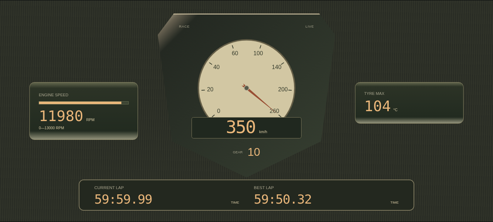 | 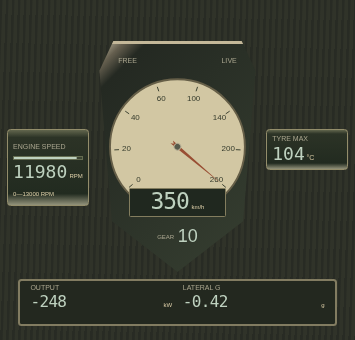 |
| 1949 前日系 | 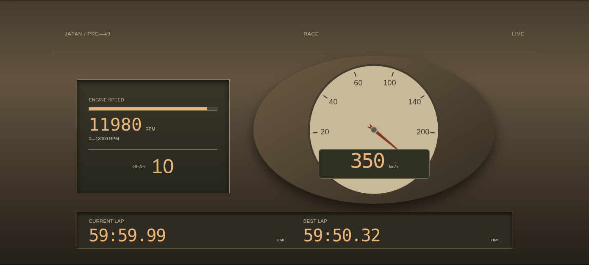 | 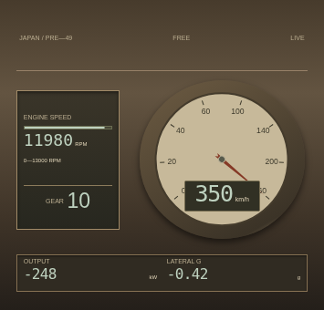 |
| 1950–1959 日系 | 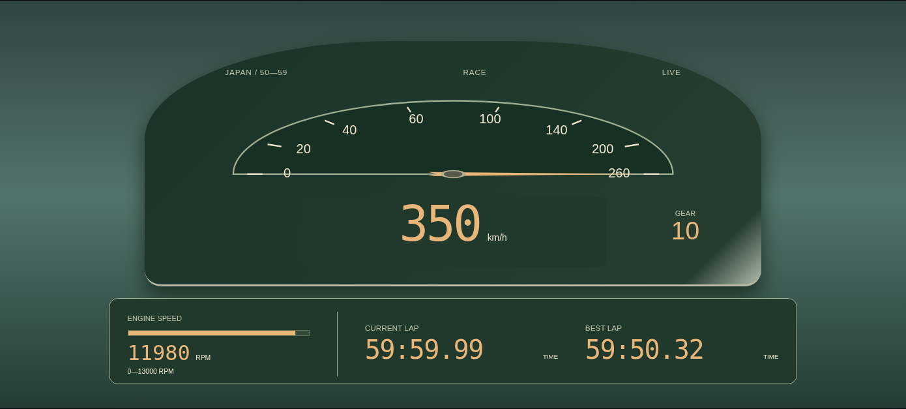 | 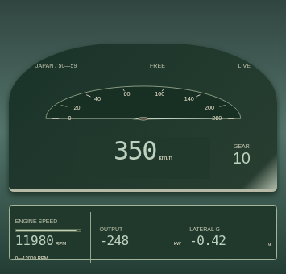 |
| 1960–1975 美系 | 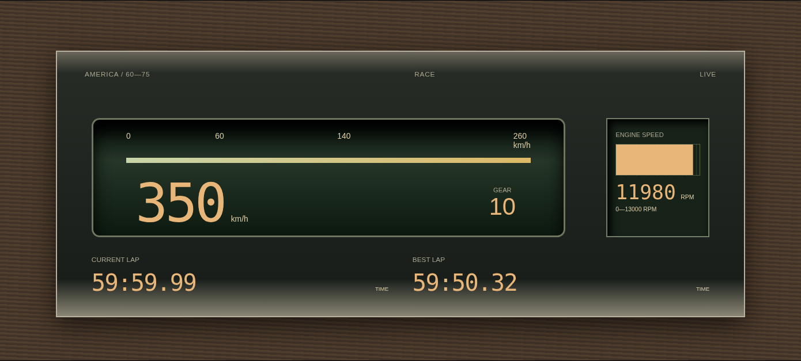 | 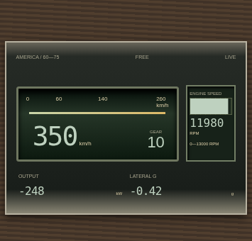 |
| 1976–1985 美系 | 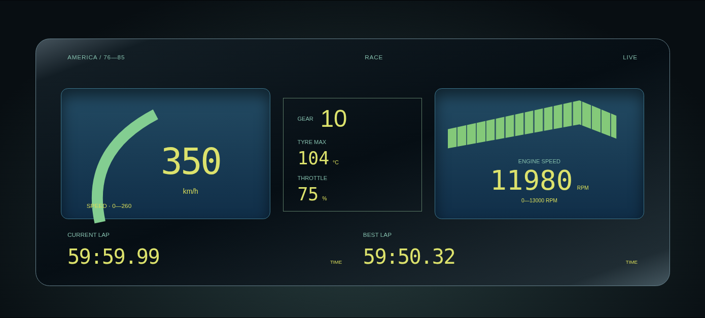 | 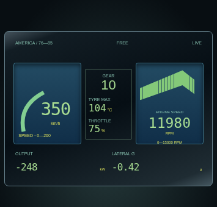 |
| 1995–2002 美系 | 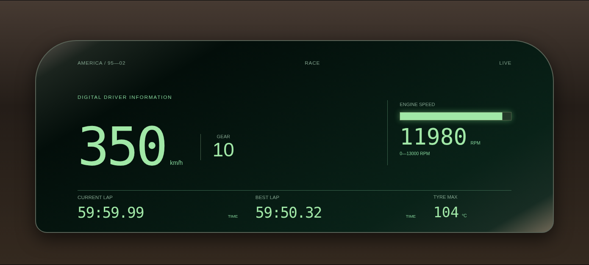 | 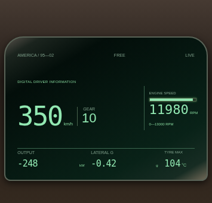 |
| 2003–2008 美系 | 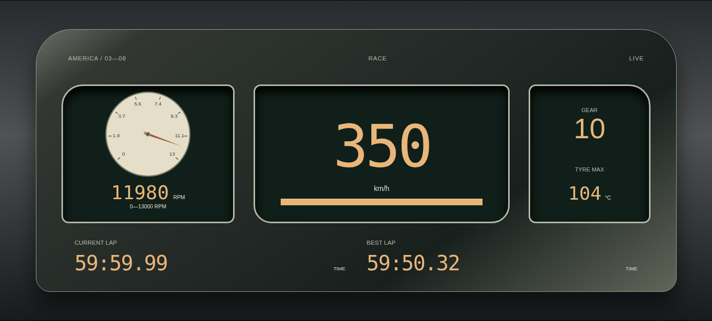 | 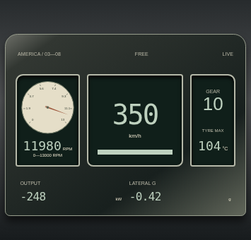 |
| 2009–2014 美系 | 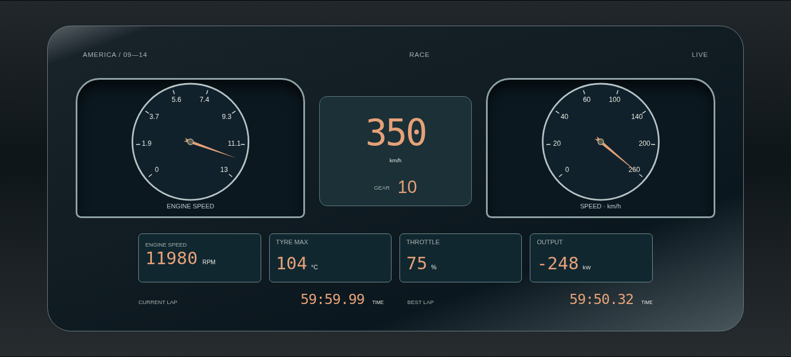 | 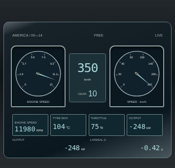 |

## 复跑

浏览器核对需要 Python Playwright 与 Chromium。仅运行检查，不自动安装依赖。`verify-instrument-completion.py` 与 `verify-instrument-switches.py` 都会自动查找 PATH 中的 `chromium` / `chromium-browser`，也可用 `--chromium` 指定路径；若未找到系统 Chromium，两者都会交给 Playwright 使用其已安装的托管 Chromium。切换检查会先归一到 Race 起始模式，再验证完整阶段顺序，并逐一检查当前仪表内所有动画表元素在熄灭阶段的稳定有效透明度。

```sh
npm test
python scripts/verify-instrument-completion.py --output-dir /tmp/completion-preview
OUTPUT_DIR=/tmp/instrument-check-sessions PORT=20448 HTTP_PORT=3069 node src/index.js
# 在另一个终端运行，真实游戏验收时另使用正式端口：
python scripts/verify-instrument-switches.py --url http://127.0.0.1:3069/ --output-dir /tmp/completion-preview
```

GitHub 集中审阅完整代码；本地检查通过后提交 PR，不自动合并。后续维护同样采用独立分支修改、验证、提交 PR、处理审核意见的流程。
