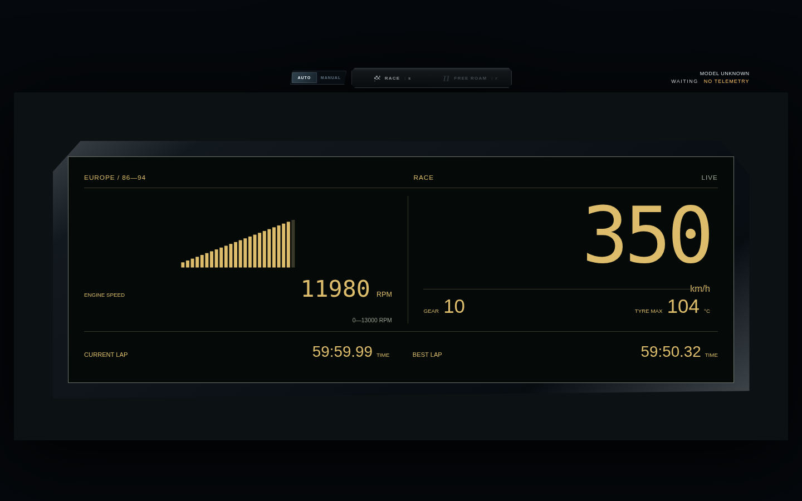
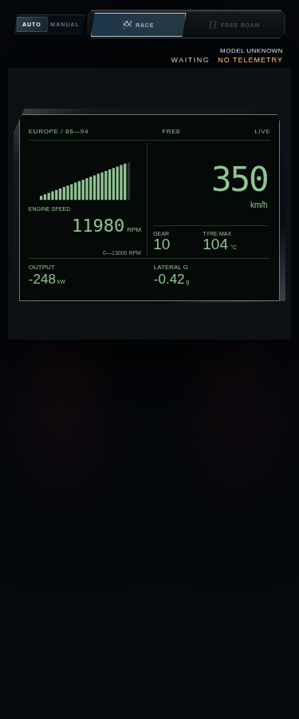
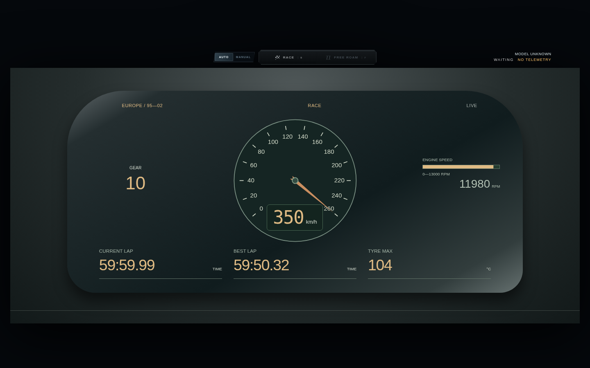
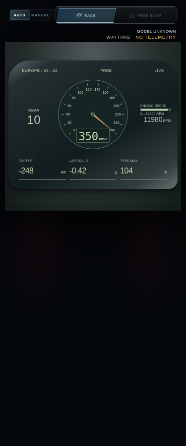
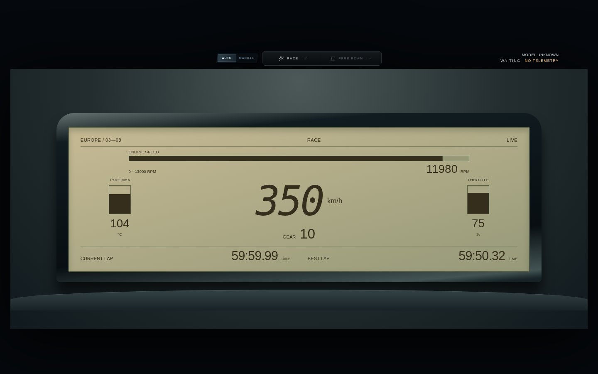
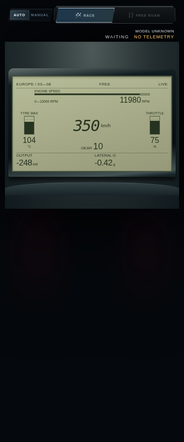

# 剩余三套欧系仪表：开发态实现、来源与验证

日期：2026-10-03。编号：`y1986_1994.europe`、`y1995_2002.europe`、`y2003_2008.europe`。

三套均已接入独立工厂，代码和浏览器预览可以审查。**只有 C4 年代找到并查看了仪表面板实物照片；Kadett／Multipla 仍是待原厂照片核对的候选布局。** 因此本次提交草稿 PR，不能将三套都记作实车外观验收完成。

本分支从 main 开始，仅新增欧系。本分支共有 23 套独立画面、10 个共享壳编号；另两套日系仍在 [PR #3](https://github.com/Presley-Liang/FH6-M-Cluster/pull/3)，两批均合并后为 25 套独立画面、8 个共享壳编号。欧洲的 11 个编号在本分支均接入独立画面，资料核实和现场验收状态另计。

## 实际网上查阅记录

| 方向 | 实际查阅的来源 | 能支持的内容及边界 |
|---|---|---|
| Kadett 年代 | [niedi74/waveshare-vdo-clock README，固定提交](https://github.com/niedi74/waveshare-vdo-clock/blob/2a22df6739e892aa4085da69143d42941b45f220/README.md) | 作者的 OPEL GSI 模式说明提到 Monza／Kadett-E 琥珀数字风格。这是第三方复绘项目，支持风格线索，**不能证明本次阶梯分段几何符合原厂**；没有查看到可靠原厂仪表照片 |
| Multipla 年代 | GitHub 搜索 `fiat multipla`、`"Fiat Multipla" "dashboard"` 等；查看相关结果后未发现可用于仪表核对的照片或说明书 | 搜索结果中的游戏项目、游记和无关词条不能作为原厂仪表依据。本次中央单速度表舱是待核实设计，不称为复刻 |
| C4 年代 | [legendtired/psa-automotive-lcd-driver README，固定提交](https://github.com/legendtired/psa-automotive-lcd-driver/blob/010f9efc52103e7c5851aaa6eaeb6c05c2b03d59/README.md)，并实际下载查看[实物 LCD 面板照片](https://raw.githubusercontent.com/legendtired/psa-automotive-lcd-driver/010f9efc52103e7c5851aaa6eaeb6c05c2b03d59/assets/02.jpg) | README 将其归为 2004–2010 C4 等 PSA 车型中央分段 LCD；照片能核对浅色正显面板、深色大速度数字、宽横框。这是拆下来的面板／台架照片，车型归属来自该作者，**不是原厂座舱照片**；完整遮光罩、比例和转速位置仍需核实 |

另搜索到 `ufnalski/citroen_c4_cluster_g431kb`，README 明确为 2011 C4 II B7，与本轮年代不符，排除。Renault 21 的搜索结果图片只包含拆下的空仪表台壳，不作为已核实仪表依据。未复制外部项目代码或图片到本仓库。

尝试访问 Citroën 官方资料候选页、Google 图片关键词搜索和 Wikipedia 时，现有代理均返回 `Tunnel connection failed: 403 Forbidden`。云端环境仍报告 restricted／enforced；通过允许访问的 GitHub 正常搜索、阅读和查看图片，没有修改代理或绕过域名策略。被拦截的官方候选地址内容和有效性未核实，不作为引证。

## 几何设计与去重边界

- Kadett 候选：深嵌宽矩形壳；左阶梯分段动力尺，右大数字速度；下沿两格驾驶信息。区别于美系整屏数字方格和 XT 透视道路。
- Multipla 候选：中央单速度圆表、左侧独立挡位、右侧细动力尺、下沿三格信息，放在宽圆角表舱内。避免 LFA 左圆右侧堆叠板的结构；没有复制五联、双主圆或 RX-8 三舱。中央圆表仍与部分运动主题存在视觉亲缘，需并排用户审查。
- C4 年代：浅色正显 LCD 单主屏、深色速度数字和侧边竖条，区别于 Prius 双屏、BMW 原有双弧、Civic 顶部折线和投影主题。当前转速条位置、遮光罩和装饰仍是游戏适配，不能称为原厂精确还原。

Race／Free 是一个主题的内容覆盖；只读公共模型，不新增 SSE、Store、Session 订阅或独立动画。复用现有换车协调器的退场、黑屏、融合车型卡、构建、年代化扫表和实时接管。

## 字段与游戏输出适配

| 显示 | 来源和规则 |
|---|---|
| 速度／挡位 | `speedKmh`／`gearLabel`。数字保留实际 350 km/h 等超量程值；Multipla 指针量程为 0–260，指针饱和与数字实际值分开处理 |
| RPM／量程 | `rpm`、优先 `rpmGauge.gaugeMax`，其次 `engineMaxRpm`；未知实际量程标 `— RPM`，不把动画的默认满量程冒充实车参数 |
| EV 动力尺 | `throttlePercent`，标为 DRIVE INPUT／%，不显示虚构发动机转速；扫表按照上下文比例，结束后直接接管最新输入 |
| 输出／横向 G | `powerKw` 与 `gX`。Free 下沿显示带符号 kW 和横向 G；负输出不推断为再生功率 |
| 胎温 | 四轮有限 `tempC` 的最大值，标为 TYRE MAX／°C。C4 原车温度槽使用胎温，不称水温 |
| 输入 | C4 侧边显示真实 `throttlePercent`，不冒充燃油条或 SOC |
| 圈速 | Race 下只有上下文确认 racing 且模型新鲜时显示当前／最佳圈速。Free 不显示伪造圈速 |
| 陈旧／缺失 | 数字显示 `—`，分段和输入条熄灭；有效零保留。动画覆盖只接受完整有限的 speed／rpm 两个比例 |

C4 的温度竖条使用 20–140 °C 显示范围，数字显示真实胎温；该范围只是游戏表尺，不定义轮胎安全阈值。所有主题不构造燃油百分比、油温、水温、电池 SOC、能耗、混动能量流或虚假故障灯。

## 核对与尚未完成项

- 完整 `npm test`：200/200，通过新增 14 项欧系回归和 HTTP／UDP 集成检查。
- 三套 × 375／469／1440 × Race／Free × 燃油／EV，共 36 组模拟长读数检查；对文字内容使用浏览器 Range 进行外框和相互重叠检查。发现的问题修复后重跑，最终无越界／文字重叠；[结果](previews/europe-remaining/layout-checks.json)。这不能保证任意长度、任意设备字体均无问题。
- 27 组 CSS 阶段检查确认关机读数与指针／分段隐藏、live 恢复；[结果](previews/europe-remaining/css-phase-checks.json)。此项在减少动态效果设置下隔离核对终态，不代表运动轨迹逐帧验收。
- 实际服务页面（非减少动态效果）通过页面按钮选择三套主题，并分别切到 Free／Race；六次模式切换均回到 live，只有一个活动仪表，无脚本错误或失败资源响应。记录包含退场、黑屏、车型卡、构建、扫表与接管的实际阶段；[记录](previews/europe-remaining/live-animation-checks.json)。输入来自无游戏的测试服务，没有将此称为真实驾驶验收。
- 还未完成：Kadett／Multipla 原厂实物参照、C4 完整座舱与车型变体核对、用户最终排版与动画观感、真实 FH6／EV 数据和持续帧率。

检查脚本可复跑（需要环境已有 Python Playwright 与 Chromium，不会自动安装依赖）：

```bash
python scripts/verify-europe-instruments.py --output-dir /tmp/europe-preview
```

实际页面检查还可启动 `PORT=0 HTTP_PORT=3068 node src/index.js`，从 Manual 主题菜单选择三个对应年代的欧系按钮，再依次切换 Free／Race；静态脚本与实际动画记录是不同验证层级。

## 浏览器模拟预览

以下都是工厂使用合成输入的浏览器截图，**不是实车参考图或游戏运行截图**。顶部 WAITING／NO TELEMETRY 属于静态预览壳。合成输入包含 350 km/h、11980 RPM、10 档、59:59.99 圈时和带符号输出。

| 主题 | Race／1440 | Free／375 |
|---|---|---|
| Kadett 候选 |  |  |
| Multipla 候选 |  |  |
| C4 年代 |  |  |
