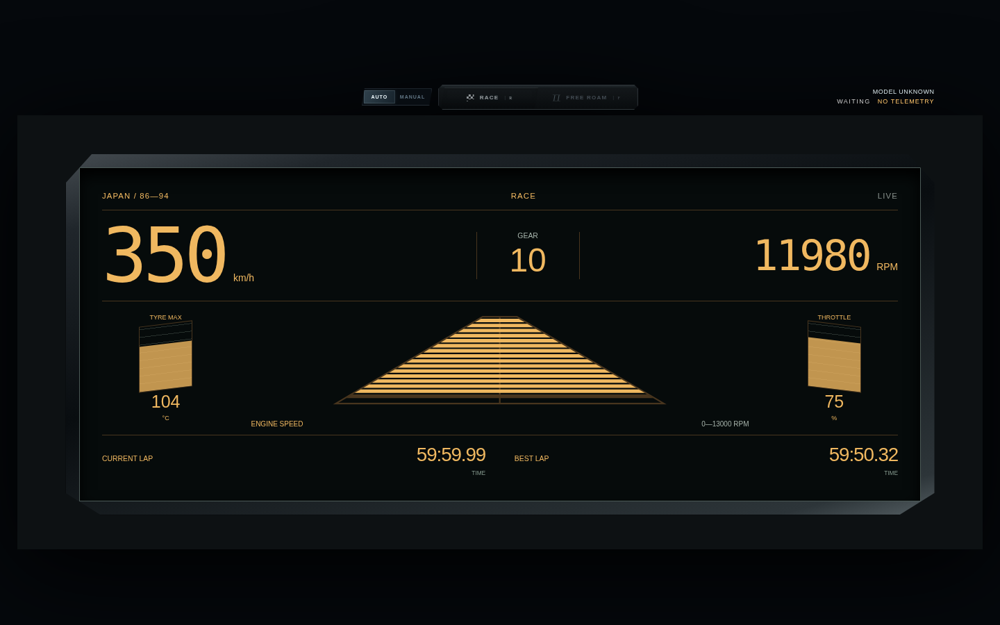
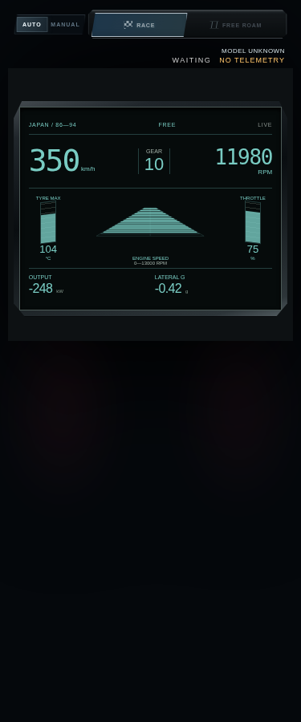
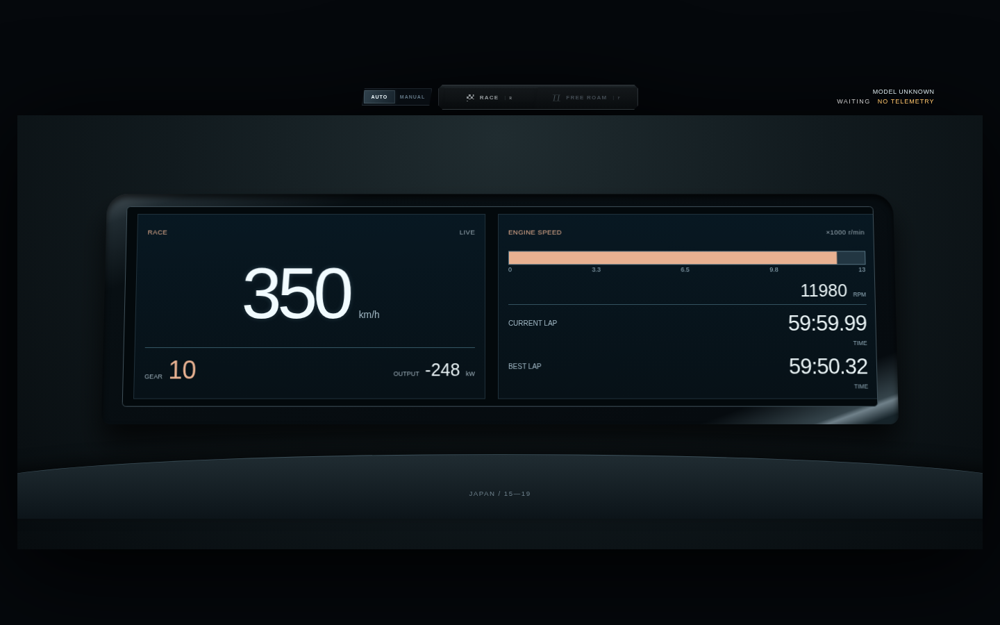
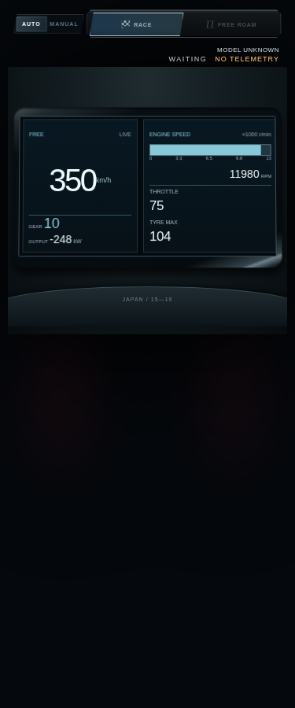

# XT／Prius 年代日系仪表：开发态实现与参考边界

> 本文保留各批次当时的来源与验证记录；当前已整合到 PR #4，最新 33／0 状态及欧系审核修复见[整合交付](ALL_INSTRUMENTS_COMPLETION_2026-10-03.md)。

日期：2026-10-02。对应编号为 `y1986_1994.japan` 和 `y2015_2019.japan`。两套已经接入独立仪表，代码、模拟预览和实际页面选择可供审查；原厂实物照片对照和真实游戏驾驶验收尚未完成，因此本次提交草稿 PR。

## 参考来源与未完成项

- XT：实际访问并查看了 [michaelfiber/xtdash](https://github.com/michaelfiber/xtdash) 的 README 与[截图](https://raw.githubusercontent.com/michaelfiber/xtdash/main/xtdash.png)。该项目作者称其设计参照 1986 Subaru XT；它是第三方电脑仪表复绘，**不是原厂资料或实车照片**。本次借鉴透视道路、侧边柱状区和数字分区的视觉方向，自行实现 SVG／CSS，未复制该项目代码或图片资产。
- Prius：目标方向为第四代 Prius 年代的中置遮光罩、左速度屏／右信息屏。尝试访问 Toyota Pressroom 的 2016 Prius product information 地址时，环境代理在建立连接前返回 403，未能查看其正文或实车照片；该地址本身也未得到内容核实。当前双屏构图是待核实的设计方案，不能称为与原厂实物比对完成。
- 环境状态报告为 restricted／enforced 网络策略，允许包管理器预设；GitHub 访问可用，尝试的官方资料及图片搜索网站被代理拒绝。用户已授权工作，聊天授权不会修改环境域名策略。
- 下一步：补充可核实的原厂／实车仪表照片，逐项对照外框比例、分区、数字位置和材质；必要时修改当前布局，再申请实车视觉验收。

## 主结构与去重

| 主题 | 当前结构 | 与已接入布局的区别 |
|---|---|---|
| XT 年代 | 顶部速度／挡位／动力数字，中心透视道路分段，两侧竖条，下方两格必要信息 | 避开 JDM90／RX-8／LFA 大圆，也不复用美系数字方格 |
| Prius 年代 | 中置深遮光罩内左右矩形屏，左速度／挡位／输出，右细动力尺与信息 | 避开 LFA 圆 TFT、Civic 顶部连续转速尺和原欧系双弧 |

Race／Free 是同一主题的内容与颜色覆盖。换车与切模式继续使用公共动画协调器，独立工厂只接受已选择的遥测模型和上下文，不新增 SSE、Store 或 Session 订阅。切模式退场保留旧模式标签，构建后再切换。自定义透视分段在关机阶段熄灭；减少动态效果沿用公共策略。

## 游戏字段适配

| 数据 | 显示规则 |
|---|---|
| `speedKmh`／`gearLabel` | 数字速度与挡位；实时数字不按扫表上限截断，零保留，缺失／陈旧显示 `—` |
| `rpm`／`rpmGauge.gaugeMax`／`engineMaxRpm` | 燃油车动力尺使用当前量程，数字直接显示实际 RPM；未知量程不猜实际满量程 |
| `throttlePercent` | 燃油车输入读数；EV 的动力尺明确标为 DRIVE INPUT／%，不伪装发动机转速 |
| `powerKw` | 保留真实符号和 kW 单位；负值只称输出，不据此推测再生制动 |
| `wheels[].tempC` | TYRE MAX／°C；不冒充冷却液或油温；无有效温度显示 `—` |
| `currentLap`／`bestLap` | Race 信息，只有上下文确认 racing 且数据新鲜时显示圈速 |
| `gX`／`brakePercent` | 横向 G／实际制动输入，缺失降级，不猜值 |

XT 的 Free 下方显示燃油车输出或 EV 制动输入，以及横向 G，避免重复侧边油门和顶部 EV 输出。Prius 的 Free 右信息区显示燃油车油门或 EV 横向 G，以及最高胎温，避免重复左屏输出。Prius 没有 SOC、CHG／ECO／POWER 区间、能耗、能量流或虚构混动切换；原车缺少可靠对应字段的部位使用明确标注的游戏驾驶数据。

## 验证记录

- `npm test`：193/193 通过，覆盖实际序列化工厂、有效零值、带符号输出、陈旧数据、实时接管、退场标签、圈速门控、动态量程、EV 适配与数据去重，并包含 HTTP／UDP 集成检查。
- 模拟预览：375／469／1440 宽度 × Race／Free × 燃油／EV，共 24 组长读数外框检查，无越界或脚本异常。采用 350 km/h、11980 RPM、10 档、长圈时等合成输入；[检查记录](previews/japan-xt-prius/layout-checks.json)。外框检查不等于逐个文本之间无重叠或真实游戏验收。
- 实际服务页面：HTTP 200，通过页面按钮选择两套主题，均进入 custom／live，始终只有一个仪表可见；资源无失败响应，浏览器无脚本异常。宿主缓存此前选择的隐藏仪表属于已有设计。
- 真实 FH6、真实 EV、持续帧率和用户视觉验收：待完成。

## 模拟预览（不是实车参考照片）

下图为真实序列化仪表工厂使用合成输入的浏览器截图；顶部 WAITING／NO TELEMETRY 是静态预览壳的状态，不是游戏截图。移动窄窗允许压缩字号，需用户结合实际设备审查可读性。

XT／Race／1440：

XT／Free／375：

Prius／Race／1440：

Prius／Free／375：

